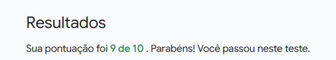
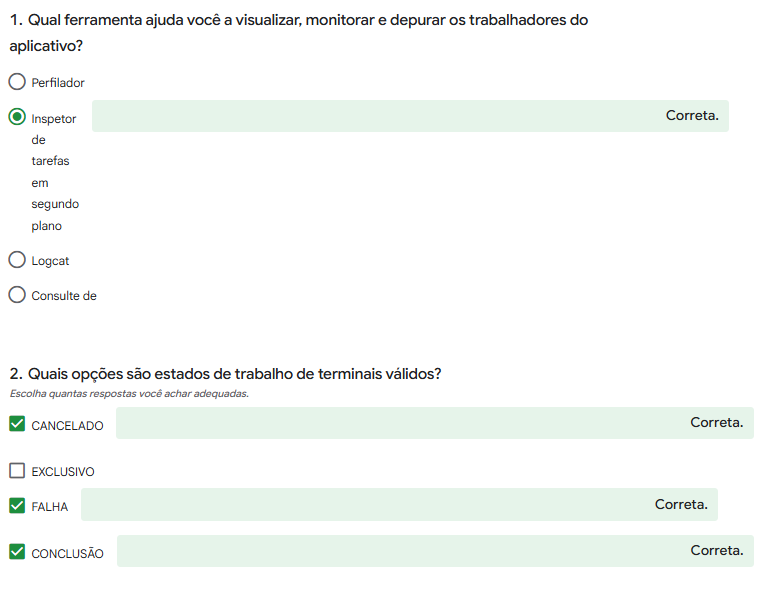
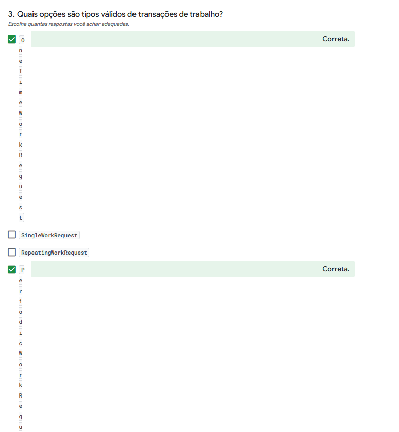
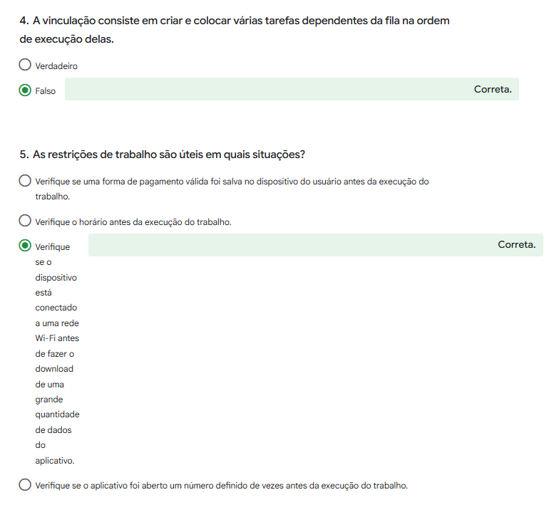
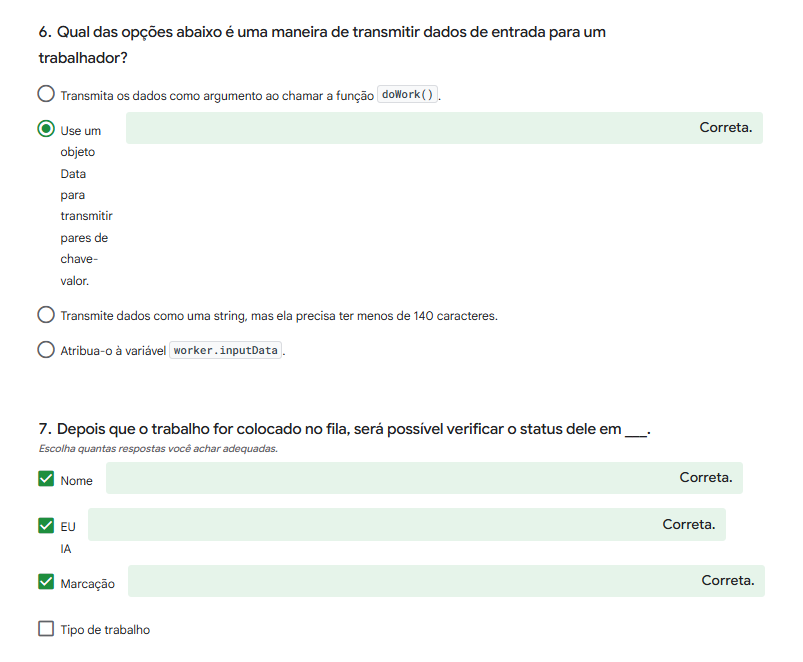
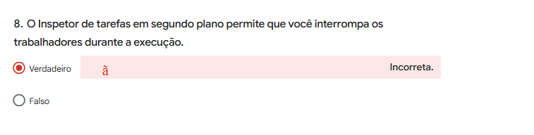
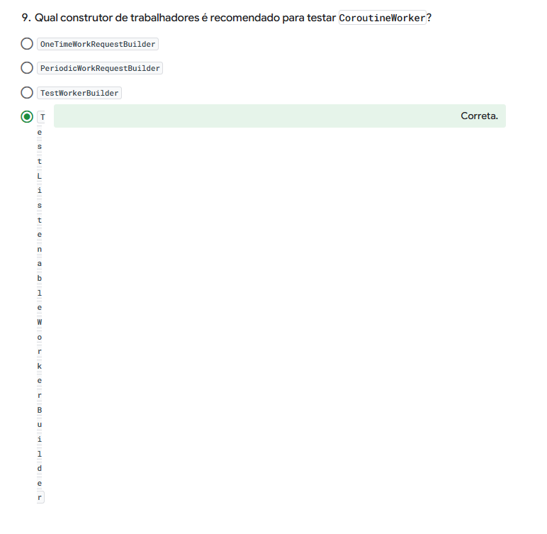

# Blur-O-Matic com WorkManager

Atividade prática sobre **WorkManager** (Android Jetpack), feita a partir do codelab
"Background Work with WorkManager" da trilha Android Basics with Compose (Unidade 7).

## O que o app faz
O usuário escolhe o nível de desfoque e clica em **Start**. O WorkManager desfoca a
imagem em segundo plano e mostra uma notificação com o caminho do arquivo gerado.

## Onde está cada parte do código
- **Worker (`doWork()`):** `workers/BlurWorker.kt`. É um `CoroutineWorker` que lê a
  URI da imagem e o nível de desfoque (`inputData`), aplica o desfoque e devolve
  `Result.success()`.
- **Requisição e Constraints:** `data/WorkManagerBluromaticRepository.kt`. Cria um
  `OneTimeWorkRequest` com `setInputData(...)` e uma restrição de bateria
  (`setRequiresBatteryNotLow(true)`).
- **Enfileiramento:** no mesmo arquivo, com `workManager.enqueue(...)`.

## Vídeo de demonstração
https://youtu.be/9CJgQ4uXROM?si=OwaGHDtNMxyCg8Lz

## Quiz da trilha
Resultado: **9 de 10**.

### Respostas assinaladas

